<div align="center">

#  Hey there, I'm Bagus!
### 

</div>

```python
class DataEngineer:
    def __init__(self):
        self.name = "Ida Bagus Gede Purwa Manik Adiputra"
        self.role = "Data Engineer & Analytics Wizard 🧙‍♂️"
        self.location = "Tangerang, Indonesia 🇮🇩"
        self.current_status = "Final Year CS Student @ Bina Nusantara"

    def get_daily_workflow(self):
        return [
            "☕ Coffee first, code second",
            "🔧 Design data pipelines that don't break",
            "☁️ Deploy to cloud (preferably without downtime)",
            "📊 Transform messy data into beautiful insights",
            "🚀 Automate everything (because why do it twice?)",
            "🌅 Watch data flow like a beautiful sunrise"
        ]

    def current_focus(self):
        return {
            "learning": ["Advanced Kubernetes", "ML Engineering", "Data Mesh"],
            "building": ["Champions League Analytics Platform", "Real-time Football Data Pipeline"],
            "improving": ["20% operational efficiency @ BCA Bank"],
            "dreaming": ["Becoming the next data engineering rockstar 🎸"]
        }

bagus = DataEngineer()
print(f"Currently {bagus.current_status} and loving every pipeline! 🚀")
```

<div align="center">

[](https://www.linkedin.com/in/idabaguspurwa/)
[](https://idabaguspurwa.com)
[](mailto:ida.adiputra@outlook.com)


</div>

---

## 🚀 The Data Journey

```mermaid
graph LR
    A[📥 Raw Data] --> B[🔄 Apache Kafka]
    B --> C[⚡ Apache Spark]
    C --> D[☁️ Cloud Storage]
    D --> E[🏠 Data Warehouse]
    E --> F[📊 BI Dashboards]
    F --> G[💡 Business Insights]

    style A fill:#ff6b6b
    style G fill:#4ecdc4
    style C fill:#45b7d1
    style E fill:#96ceb4
```

<div align="center">



</div>

> **"Data is the new oil, but I'm the one building the refineries!"** ⚡

### 🎓 Academic Journey
```
📚 Bachelor of Computer Science @ Bina Nusantara University
🎯 GPA: 3.62/4.00  |  🎓 Graduating: October 2025
📖 Thesis Focus: Scalable Data Engineering Architectures
```

---

## 💼 Where the Magic Happens

<div align="center">

### 🏦 Business Analyst Intern @ PT Bank Central Asia
**📅 February 2024 - February 2025**

</div>

```yaml
mission_accomplished:
  stakeholder_interviews: "✅ Decoded business requirements like a data detective 🕵️"
  operational_insights: "✅ Transformed data chaos into decision-making gold 💰"
  cross_functional_collaboration: "✅ Bridge builder between IT wizards and business ninjas 🌉"
  efficiency_boost: "✅ Delivered 20% operational efficiency improvement 📈"

secret_weapons:
  - "Advanced SQL sorcery 🪄"
  - "Data visualization artistry 🎨"
  - "Process optimization ninja skills 🥷"
  - "Stakeholder whispering abilities 💬"
```


---

## 🎮 Tech Stack & Skill Tree

<div align="center">

### 🛡️ Choose Your Weapon
*Level: Junior Data Engineer* 🏆

</div>

<details>
<summary>☁️ <strong>Cloud Kingdoms</strong> (Click to expand)</summary>
<br>


</details>

<details>
<summary>🏗️ <strong>Data Engineering Arsenal</strong> (Click to expand)</summary>
<br>


</details>

<details>
<summary>💾 <strong>Database Dynasty</strong> (Click to expand)</summary>
<br>


</details>

<details>
<summary>🐍 <strong>Programming Power-Ups</strong> (Click to expand)</summary>
<br>


</details>

<details>
<summary>📊 <strong>Visualization Wizardry</strong> (Click to expand)</summary>
<br>


</details>

<details>
<summary>🚀 <strong>DevOps & Deployment</strong> (Click to expand)</summary>
<br>


</details>

<div align="center">

### 🏆 **Achievement Unlocked: Full-Stack Data Engineer**
*"Jack of all trades, master of data!"* ⚡

</div>

---

## 🚀 Epic Project Showcase

<div align="center">

### *"Building the future, one pipeline at a time"* ⚡

</div>

---

### ⚽ **Champions League Data Platform** 🏆
<div align="center">

**🏗️ Enterprise-Grade AWS EKS Data Platform**


</div>

```javascript
const championsPlatform = {
  mission: "Transform football chaos into championship insights ⚽",
  architecture: "Production-grade data lakehouse on AWS EKS",

  achievements: {
    infrastructure: "🏗️ Terraform-powered secure VPC + EKS + S3 + Redshift",
    cicd: "🚢 4 microservices auto-deployed via GitHub Actions",
    orchestration: "⚙️ Airflow + KubernetesPodOperator magic",
    dataFlow: "✨ Bronze → Silver → Gold transformation pipeline",
    insights: "📈 Real-time Tableau dashboards for team analytics"
  },

  coolnessFactor: "🔥🔥🔥🔥🔥 (Maximum level achieved!)"
};
```

---

### 🛒 **E-Commerce Data Platform** 📊
<div align="center">

**☁️ Google Cloud-Powered Analytics Engine**


</div>

```yaml
project_status: "✅ Mission Accomplished"
highlights:
  - name: "Scalable ETL Platform"
    tech: "GCP + Terraform Infrastructure as Code"
    impact: "🎯 Zero-downtime deployments"

  - name: "Modern Data Modeling"
    tech: "dbt + BigQuery + Data Quality Tests"
    impact: "📈 Automated data validation & transformation"

  - name: "Business Intelligence"
    tech: "Looker Studio Interactive Dashboards"
    impact: "💰 Real-time profitability insights"

secret_sauce: "Fully automated + Reproducible + Scalable 🚀"
```

---

### ⚡ **Real-Time Football Pipeline** 🏟️
<div align="center">

**🔥 Streaming Data Engineering at Scale**


</div>

```python
class RealTimeFootballPipeline:
    def __init__(self):
        self.streaming_power = "⚡ Live API → Kafka → Spark → BigQuery"
        self.automation_level = "🤖 Fully automated via Cloud Composer"
        self.deployment = "🚀 Terraform-managed infrastructure"

    def get_impact(self):
        return {
            "data_freshness": "📊 Real-time metrics & team performance",
            "reliability": "🛡️ Resilient automated workflows",
            "scalability": "📈 Cloud-native horizontal scaling"
        }

# Pipeline running 24/7 like a champion! 🏆
pipeline = RealTimeFootballPipeline()
```

<div align="center">

### 🎯 **Want to explore more?**
Check out my repositories below for the full technical deep-dive! 👇

</div>

---

## 🏅 Achievement Badges & Certifications

<div align="center">

### 🎯 **Professional Certifications Unlocked**

</div>

<table align="center">
<tr>
<td align="center" width="25%">
<br>
<b>🌊 Airflow Mastery</b><br>
<sub>Udemy Certified</sub><br>
✅ <b>COMPLETED</b>
</td>
<td align="center" width="25%">
<br>
<b>❄️ Data Engineer</b><br>
<sub>DataCamp Certified</sub><br>
✅ <b>COMPLETED</b>
</td>
<td align="center" width="25%">
<br>
<b>🔧 Databricks & Spark</b><br>
<sub>Udemy Certified</sub><br>
✅ <b>COMPLETED</b>
</td>
<td align="center" width="25%">
<br>
<b>🐙 Foundations</b><br>
<sub>GitHub Certified</sub><br>
✅ <b>COMPLETED</b>
</td>
</tr>
</table>

---

## 🌍 Global Communication

<div align="center">

```yaml
languages:
  english:
    level: "🇬🇧 Proficient"
    skills: ["Technical Documentation", "Stakeholder Communication", "Code Reviews"]

  indonesia:
    level: "🇮🇩 Native"
    skills: ["Cultural Bridge", "Local Market Understanding", "Team Leadership"]

communication_style: "🎯 Direct, Clear, Results-Oriented"
```

</div>

---

## 📊 GitHub Analytics Dashboard

<div align="center">

### 🔥 **Current Stats & Achievements**

</div>

<div align="center">
<table>
<tr>
<td width="50%">


</td>
<td width="50%">


</td>
</tr>
</table>
</div>

<div align="center">


</div>

<div align="center">

### 🏆 **GitHub Trophies**


</div>


---

## 🤝 Let's Build Something Amazing Together!

<div align="center">

### 💭 **Always up for...**

```json
{
  "collaboration": "🚀 Data engineering projects that change the world",
  "discussions": "💡 Latest trends in big data, ML, and cloud architecture",
  "opportunities": "🌟 Exciting roles in data engineering & analytics",
  "coffee_chats": "☕ Virtual meetups to share knowledge & insights",
  "mentoring": "🎓 Helping aspiring data engineers level up"
}
```

</div>

---

<div align="center">

### 📬 **Reach Out Through Your Favorite Channel**

<table>
<tr>
<td align="center" width="25%">
<a href="mailto:ida.adiputra@outlook.com">

<br><b>📧 Email Me</b><br>
<sub>Let's discuss ideas!</sub>
</a>
</td>
<td align="center" width="25%">
<a href="https://www.linkedin.com/in/idabaguspurwa/">

<br><b>🔗 Connect</b><br>
<sub>Professional networking</sub>
</a>
</td>
<td align="center" width="25%">
<a href="https://idabaguspurwa.com">

<br><b>🌐 Portfolio</b><br>
<sub>Deep dive into projects</sub>
</a>
</td>
<td align="center" width="25%">

<br><b>📍 Tangerang</b><br>
<sub>Indonesia 🇮🇩</sub>
</td>
</tr>
</table>

</div>

---

<div align="center">

### 🎯 **Current Status**

```python
def current_mission():
    return {
        "🎓": "Finishing CS degree @ Bina Nusantara (Oct 2025)",
        "💼": "Crushing it @ BCA Bank as Business Analyst Intern",
        "🚀": "Building next-gen data platforms",
        "📚": "Learning ML Engineering & Data Mesh architecture",
        "🎸": "Dreaming of becoming a data engineering rockstar"
    }

# Always ready for the next challenge! 💪
status = current_mission()
```


### 💫 ***"Turning data into insights, one pipeline at a time!"***


</div>

---

<div align="center">
<h3>⭐ If you like my work, consider giving my repos a star! ⭐</h3>

</div>